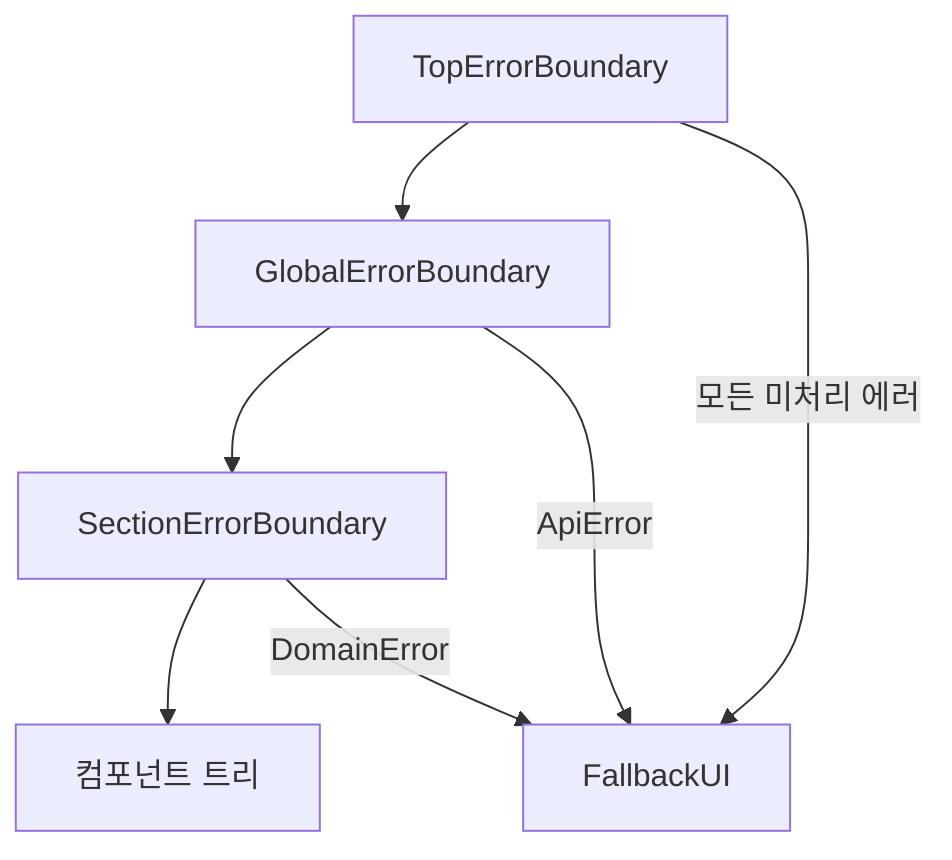

# Money Exchange App

환율 조회 및 환전 거래를 위한 웹 애플리케이션입니다. 현대적인 React 생태계와 TypeScript를 기반으로 구축되었으며, 견고한 에러 처리, 체계적인 상태 관리, 그리고 최적화된 사용자 경험을 제공합니다.

## 목차

- [프로젝트 소개](#프로젝트-소개)
- [프로젝트 실행 방법](#프로젝트-실행-방법)
- [기술 스택과 선정 이유](#기술-스택과-선정-이유)
- [에러 처리 전략](#에러-처리-전략)
- [QueryKey와 Option 관리](#querykey와-option-관리)
- [디자인 토큰과 시스템](#디자인-토큰과-시스템)
- [최적화 전략](#최적화-전략)
- [프로젝트 구조](#프로젝트-구조)

## 프로젝트 소개

### 주요 기능

- **실시간 환율 조회**: 주요 통화의 실시간 환율 정보 제공
- **환전 견적 계산**: 원하는 금액에 대한 환전 견적 조회
- **환전 거래**: 실제 환전 주문 생성 및 처리
- **거래 내역 조회**: 과거 환전 거래 내역 조회 및 관리 (컬럼별 정렬 기능 지원)
- **지갑 관리**: 사용자 지갑 정보 조회 및 관리

## 프로젝트 실행 방법

### 필수 요구사항

- **Node.js**: v18 이상
- **pnpm**: v8 이상 (권장 패키지 매니저)

### 설치 및 실행

```bash
# 의존성 설치
pnpm install

# 개발 서버 실행
pnpm dev

# 프로덕션 빌드
pnpm build

# 빌드 결과물 미리보기
pnpm preview
```

개발 서버는 기본적으로 `http://localhost:5173`에서 실행됩니다.

### 환경 변수

프로덕션 환경에서는 다음 환경 변수를 설정해야 합니다:

```env
VITE_BASE_ENDPOINT=https://your-api-endpoint.com
```

개발 환경에서는 Vite의 proxy 설정을 통해 `/api` 경로가 자동으로 프록시됩니다.

## 기술 스택과 선정 이유

### TanStack React Table

**선정 이유**: Headless 테이블 엔진으로 UI와 로직을 완전히 분리할 수 있어, 테이블 렌더링 로직과 비즈니스 로직을 독립적으로 관리할 수 있습니다.

**주요 특징**:
- **UI와 로직 분리**: 테이블 엔진은 데이터 변환과 상태 관리만 담당하고, 렌더링은 개발자가 완전히 제어
- **컬럼 정의 분리**: `createColumns()` 팩토리 함수를 통해 컬럼 정의를 독립적으로 관리
- **타입 안전성**: TypeScript와 완벽하게 통합되어 타입 안전한 테이블 구현 가능
- **클라이언트 사이드 정렬**: 모든 컬럼에 대해 오름차순/내림차순 정렬 기능 제공
  - 헤더 클릭으로 정렬 상태 토글 (오름차순 → 내림차순 → 정렬 없음)
  - 날짜 컬럼은 커스텀 정렬 함수로 날짜 순서대로 정렬
  - 정렬 상태는 외부에서 관리되어 테이블 재사용성 향상

**파일 구조**:
- `columns.tsx`: 컬럼 정의 및 비즈니스 로직 (정렬 함수 포함)
- `table-header.tsx`: 테이블 헤더 렌더링 (정렬 아이콘 및 클릭 핸들러)
- `table-body.tsx`: 테이블 바디 렌더링 (정렬된 데이터 표시)
- `history-table-content.tsx`: 테이블 루트 컴포넌트 (정렬 상태 관리)

### TanStack React Query

**선정 이유**: 서버 상태 관리, 캐싱, 동기화를 위한 강력한 라이브러리로, 복잡한 서버 상태를 선언적으로 관리할 수 있습니다.

**주요 특징**:
- **자동 캐싱**: 쿼리 결과를 자동으로 캐싱하여 불필요한 네트워크 요청 방지
- **Suspense 지원**: React Suspense와 통합하여 로딩 상태를 선언적으로 처리
- **백그라운드 동기화**: `refetchInterval`을 통한 주기적 데이터 갱신

### 기타 주요 라이브러리

- **React Hook Form + Zod**: 타입 안전한 폼 검증 및 관리
- **Tailwind CSS v4**: 유틸리티 퍼스트 CSS 프레임워크로 빠른 스타일링
- **Radix UI**: 접근성을 고려한 Headless UI 컴포넌트
- **React Router v7**: 클라이언트 사이드 라우팅
- **Axios**: HTTP 클라이언트 라이브러리

## 에러 처리 전략

### 계층적 Error Boundary 구조

프로젝트는 3단계 Error Boundary 계층 구조를 통해 에러를 체계적으로 처리합니다.



**구조 설명**:
- **TopErrorBoundary**: 최상위 Error Boundary로, 모든 미처리 에러의 최종 fallback 역할
- **GlobalErrorBoundary**: `ApiError`만 처리하며, `DomainError`는 상위로 전파
- **SectionErrorBoundary**: 도메인별 에러를 처리하는 Error Boundary. 지정된 도메인 에러 타입만 처리하고, 나머지는 상위로 전파
- **FallbackUI**: 사용자 친화적인 에러 UI를 제공하며, 에러 코드에 따라 적절한 메시지를 표시

**핵심 원칙**:
- 에러는 반드시 `throw`를 통해 전파되어야 하며, 컴포넌트에서 error를 return하거나 상태로 관리 금지
- 타입이 곧 처리 위치: 에러 타입에 따라 적절한 ErrorBoundary에서 처리
- SectionErrorBoundary는 담당 타입만 처리하고 나머지는 re-throw

### HttpClient 인터셉터

`HttpClient`는 Axios를 기반으로 한 HTTP 클라이언트로, 요청/응답 인터셉터를 통해 에러를 자동으로 처리합니다.

**주요 기능**:
- **요청 인터셉터**: 인증 토큰 자동 주입, Content-Type 기본값 설정
- **응답 인터셉터**: API 에러 응답을 `DomainError`로 자동 변환
- **UNAUTHORIZED 처리**: 인증 실패 시 자동 로그아웃 및 리다이렉션

### 에러 코드 관리

타입 안전한 에러 코드 정의와 에러 코드별 사용자 메시지 매핑을 통해 일관된 에러 처리를 제공합니다.

- **API 공통 에러**: `BAD_REQUEST`, `NOT_FOUND`, `UNAUTHORIZED`, `VALIDATION_ERROR`, `MISSING_PARAMETER`
- **도메인 에러**: `WALLET_INSUFFICIENT_BALANCE`, `CURRENCY_MISMATCH` 등
- 각 에러 코드는 사용자 친화적인 메시지로 매핑되어 `FallbackUI`에서 표시

## QueryKey와 Option 관리

### 중앙화된 QueryKey 관리

각 feature별로 `query.option.ts` 파일에 queryKey와 queryOptions를 중앙화하여 관리합니다. 이를 통해 타입 안전성과 재사용성을 확보합니다.

**구조**:
- `query_key`: queryKey 생성 함수들을 객체로 그룹화
- `query_option`: `queryOptions()`와 `mutationOptions()`를 활용한 옵션 정의

**예시**:

```typescript
export const exchange_rates_query_key = {
  getExchangeRatesLatest: () => ["exchange-rates-latest"],
  getExchangeRatesHistory: (body: ExchangeRateHistory) => 
    ["exchange-rates-history", body.fromCurrency, body.toCurrency, body.forexAmount],
};

export const exchange_rates_query_option = {
  getExchangeRatesLatest: () => queryOptions({
    queryKey: exchange_rates_query_key.getExchangeRatesLatest(),
    queryFn: getExchangeRatesLatestApi,
  }),
};
```

**장점**:
- 타입 안전한 queryKey 생성
- queryKey와 queryFn의 일관성 보장
- 재사용 가능한 옵션 정의
- 중앙화된 관리로 유지보수 용이

### QueryClient 기본 옵션

전역 QueryClient 설정을 통해 일관된 쿼리 동작을 보장합니다.

**주요 설정**:
- `refetchOnWindowFocus: false`: 윈도우 포커스 시 자동 refetch 비활성화
- `refetchOnMount: false`: 컴포넌트 마운트 시 자동 refetch 비활성화
- `throwOnError: true`: 에러 발생 시 ErrorBoundary로 전파
- `retry: false`: 자동 재시도 비활성화

## 디자인 토큰과 시스템

### Tailwind CSS v4 Theme 기반 디자인 토큰

프로젝트는 Tailwind CSS v4의 `@theme` 지시어를 활용하여 CSS 변수 기반 디자인 토큰 시스템을 구축했습니다.

**주요 토큰 카테고리**:
- **Colors**: Background, Text, Status, Buttons, Borders
- **Typography**: Font Family, Font Sizes, Font Weights
- **Spacing**: 일관된 간격 시스템
- **Border Radius**: 컴포넌트별 border radius
- **Shadows**: 카드 및 폼 그림자
- **Component Heights**: 버튼, 입력 필드 등 고정 높이

### UI 컴포넌트 시스템

Polymorphic 컴포넌트 패턴과 Class Variance Authority (CVA)를 활용하여 타입 안전하고 유연한 컴포넌트 시스템을 구축했습니다.

**장점**:
- 디자인 토큰 기반으로 일관된 스타일링
- 타입 안전한 variant 관리
- Polymorphic 패턴으로 유연한 컴포넌트 사용
- 재사용 가능한 컴포넌트 시스템

## 최적화 전략

### 디바운스 (Debounce)

사용자 입력에 따른 API 호출을 최적화하기 위해 `useDebouncedValue` 커스텀 훅을 구현했습니다.

**구현 방식**:
- 사용자 입력값을 500ms 디바운스하여 API 호출 최적화
- 불필요한 네트워크 요청 감소로 서버 부하 감소 및 사용자 경험 개선

**사용 예시**: 환전 견적 계산 시 금액 입력에 디바운스를 적용하여 사용자가 입력을 멈춘 후에만 API 호출

### 리렌더링 최적화

**React.memo**: 불필요한 리렌더링을 방지하기 위해 컴포넌트 메모이제이션 활용

**useMemo**: 비용이 큰 계산이나 객체 생성은 `useMemo`로 메모이제이션

**테이블 렌더링 최적화**:
- `TableBodyContent`를 `useMemo`로 메모이제이션하여 의존성이 변경될 때만 재계산
- `columns`와 `columnWidths` 계산 결과를 메모이제이션하여 매 렌더링마다 재생성 방지
- 의존성 배열에 실제로 변경되는 값만 포함하여 불필요한 재계산 방지
- 정렬 상태 변경 시 `rowModel.rows`를 의존성으로 사용하여 정렬된 데이터만 재렌더링

## 프로젝트 구조

프로젝트는 **Feature-Sliced Design (FSD)** 아키텍처를 기반으로 구성되어 있습니다.

```
src/
├── app/                    # 애플리케이션 초기화 및 설정
│   ├── layout/             # 레이아웃 컴포넌트
│   ├── provider/           # 전역 Provider (QueryClient 등)
│   └── router/             # 라우팅 설정
├── pages/                  # 페이지 컴포넌트
│   ├── home/
│   ├── history/
│   └── login/
├── widgets/                # 복합 UI 블록
│   ├── home/
│   ├── history/
│   └── login/
├── features/               # 비즈니스 기능
│   ├── exchange/
│   ├── login/
│   ├── search-exchange-history/
│   ├── search-exchange-rate-latest/
│   └── search-wallets/
├── entities/               # 비즈니스 엔티티
│   ├── exchange/
│   ├── login/
│   ├── orders/
│   └── wallet/
└── shared/                 # 공유 리소스
    ├── constants/          # 상수
    ├── errors/             # 에러 클래스
    ├── hooks/              # 공유 훅
    ├── types/              # 공유 타입
    ├── ui/                 # 공유 UI 컴포넌트
    └── utils/              # 유틸리티 함수

packages/
├── core/                   # 핵심 유틸리티
├── tokens/                 # 디자인 토큰
└── ui/                     # UI 컴포넌트 라이브러리
```

**계층 설명**:
- **app**: 애플리케이션 초기화, 라우팅, 전역 설정
- **pages**: 라우트에 매핑되는 페이지 컴포넌트
- **widgets**: 여러 feature를 조합한 복합 UI 블록
- **features**: 독립적인 비즈니스 기능 단위
- **entities**: 비즈니스 엔티티 (API, 모델, 유틸리티)
- **shared**: 프로젝트 전역에서 공유되는 리소스

---

## 라이선스

이 프로젝트는 개인 프로젝트입니다.
